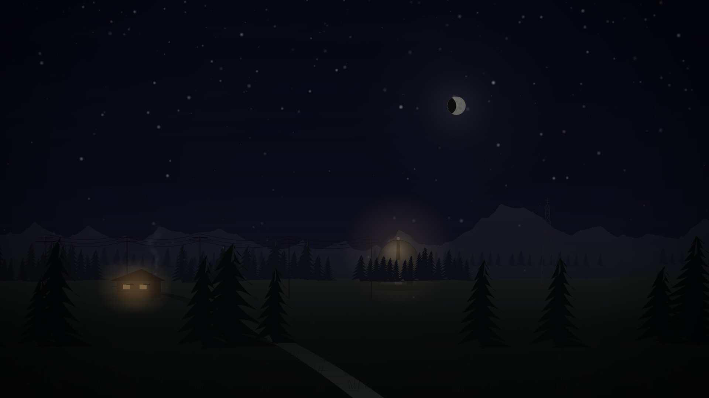
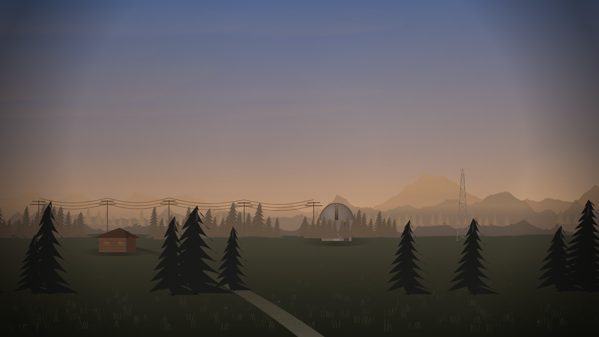
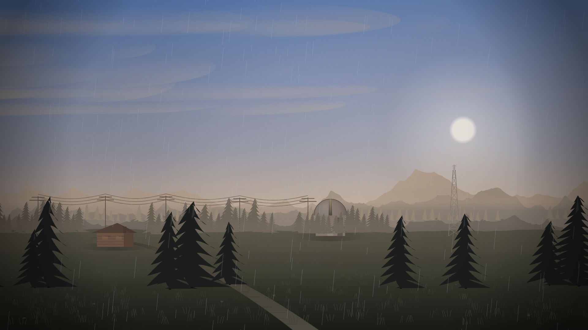
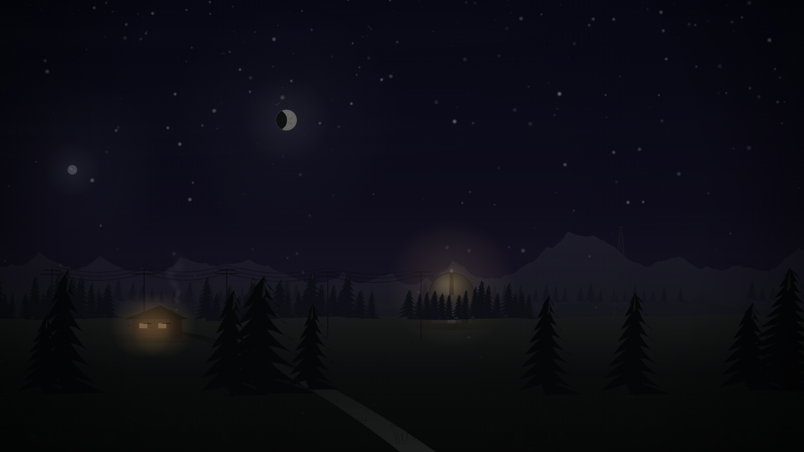

# Anomaly Engine

<p align="center">
  <strong>A live wallpaper engine where the desktop behaves like a living world.</strong>
</p>

<p align="center">
  <a href="https://github.com/realizations/anomaly-engine/actions"></a>
  <a href="https://github.com/realizations/anomaly-engine/releases"></a>
  <a href="https://github.com/realizations/anomaly-engine/blob/main/LICENSE"></a>
  <a href="https://github.com/realizations/anomaly-engine/stargazers"></a>
</p>

<p align="center">
  <em>This isn't a wallpaper. It's a world.</em><br>
  <em>It changes when the sun goes down. It reacts to the weather. It notices events.</em><br>
  <em>Sometimes something happens that you weren't expecting.</em><br>
  <em>You might miss it. That's the point.</em>
</p>

## The World

Everything below is drawn procedurally at runtime. No sprite sheets, no video loops, no
third-party art. The full gallery — 69 rendered frames across 3 art styles, 6 worlds, 7 times
of day, 6 weather states and all 6 anomalies — is generated by `node tools/showcase.mjs` and
written to `build/showcase/index.html`. The generator checks its anomaly list against the
engine and fails if a shipped anomaly has no frame, so the gallery cannot quietly fall behind.

| Night | Golden Hour |
|---|---|
|  |  |

| Storm | Second Moon (anomaly) |
|---|---|
|  |  |

### Worlds are data, not art

A world is a ~40 line object: biome, palette, terrain profile and a list of structures. The
renderer draws it. Six ship today:

| World | Biome | Reads as |
|---|---|---|
| The Town That Wasn't There | Temperate forest | A valley town on every map and none of them |
| Saltwick | Salt marsh | Tidal flats and a light that keeps time for ships that stopped running |
| The Long Fell | Alpine | Above the weather line, at a station that stopped reporting |
| The Dry Mere | High desert | A lake that was not a lake until it was not |
| The Long Head | Coast | A headland where the sea arrives earlier than the charts allow |
| The Long Corridor | Interior | A public building that is open continuously, lit by a tube that is on a timer |

Because a world contains no art, contributing one needs no asset pipeline, no licence
review, and no renderer change. Full format: [`docs/WORLD-FORMAT.md`](docs/WORLD-FORMAT.md).

Biome matters more than palette: grass belongs to a forest, snow drifts to a fell,
desiccation cracks to a dry lake bed. An early revision of The Long Fell included a desert
`butte`, which rendered as a brown box on a snowfield. `cairn` replaced it.

### Art styles

Three complete renderer treatments, switchable live from the tray. All three hold up across
the full day/night cycle, not just at golden hour.

| Style | Approach | Look |
|---|---|---|
| **Painterly** *(default)* | Gradient sky, atmospheric haze, grain, vignette | Soft depth. Stays behind your icons and text. |
| **Flat Vector** | Banded sky, solid silhouettes, per-layer value separation | Crisp and graphic. Reads cleanly at any resolution. |
| **Riso Print** | Hue-safe tonal quantisation, 1px channel misregistration, halftone | Two-ink screen-print character. |

> Flat and riso reach their look by drawing flat fills natively and quantising *luminance*
> rather than each RGB channel. Per-channel posterisation destroys hue — a dark blue
> `(30,8,26)` snaps to magenta — which is why the earlier flat styles rendered as false
> colours and grey slabs at night.

---

## Table of Contents

- [Features](#features)
- [Quick Start](#quick-start)
- [How to Use](#how-to-use)
- [Creating a World](#creating-a-world)
- [World Format](#world-format)
- [Architecture](#architecture)
- [CLI](#cli)
- [Contributing](#contributing)
- [Roadmap](#roadmap)
- [Verification](#verification)
- [Asset Licensing](#asset-licensing)
- [Naming](#naming)
- [License](#license)

## Features

Honest status. **Working** means verified by an automated check. **Scaffold** means the
code exists and is real, but is not connected to anything visible yet. We would rather say
so than ship a feature table that overstates the project.

### Working

| Feature | Description |
|---------|-------------|
| **Procedural world** | Ridges, conifers, power lines, road, radio tower, observatory and stars all generated from seeded noise. Zero third-party art. |
| **Worlds as data** | Six shipped worlds as ~40 line objects, plus one interior built by a separate scene constructor rather than the terrain pipeline. Biome-aware ground, structures placed by data, no art pipeline needed to add one. |
| **Real local time** | Sky, sun position, moon phase and colour grading follow the system clock and a real latitude/longitude. |
| **Weather** | Six conditions driving cloud cover, wind-aligned precipitation, lightning and fog density. |
| **Anomaly layer** | Six anomalies with rarity, cooldowns and durations, fired through the event bus and written to the journal. |
| **Field notes** | The ARG surface. World premise, observations and progress, from the tray or `Ctrl+Alt+F`. Every anomaly is paired with a plausible denial. |
| **Durable state** | World, style, reduced motion, journal and secrets persist to a JSON document in `%APPDATA%` via the native host. A corrupt save cannot stop the engine starting. |
| **Dynamic quality** | The scene renders to an offscreen buffer and blits up. Render scale adapts to hold a frame budget. |
| **Live art-style switching** | Three renderer treatments from the tray or `Ctrl+Alt+S`, with an active-style checkmark. |
| **Global hotkeys** | `Ctrl+Alt+W/S/P/F/D` — cycle world, cycle style, pause, field notes, debug. Registered with Windows, because the wallpaper never holds focus. |
| **Reduced motion** | Honours the OS `prefers-reduced-motion` preference by scaling ambient animation to 25%. |
| **Settings window** | Live readouts from the renderer and working controls for world, style, frame rate, quality and reduced motion. Also opens with `--settings`. |
| **Fullscreen passthrough** | Yields to fullscreen apps, excludes shell and `WorkerW` windows, and a manual pause survives a fullscreen app closing. |
| **Diagnostics** | `--diagnose`, `--capture`, window enumeration, `WorkerW` probing, structured JSON logging. |
| **Offline-first, no telemetry** | No accounts, no tracking, works with the network off. |

### Scaffold — real code, not yet visible

| Feature | What's missing |
|---------|----------------|
| **ARG event sources** | GitHub, RSS and remote event adapters are implemented but intentionally unconfigured and off by default. They need endpoint URLs, payload validation and rate limits. |
| **Multi-monitor** | Every display is composed separately, so a mixed aspect-ratio setup gets correct framing on each rather than one crop of a wide panorama. Follows hot-plug. |
| **Audio reactivity** | The system exists; desktop audio capture does not, so it is inert. |
| **Distribution** | No installer, no code signing, no auto-update. |

### Deliberate non-goals for now

- **No third-party art.** Anything drawn can be generated, so there is no licence to inherit
  and no resolution ceiling. The licence gate exists to keep it that way if that changes.
- **No telemetry and no accounts.** The engine works with the network off.


## Quick Start

### Prerequisites

- Windows 10/11
- [.NET 8 SDK](https://dotnet.microsoft.com/download/dotnet/8.0)
- [Node.js 20+](https://nodejs.org/)
- [WebView2 Runtime](https://developer.microsoft.com/microsoft-edge/webview2/) (pre-installed on Windows 11)

### Build

```bash
git clone https://github.com/realizations/anomaly-engine.git
cd anomaly-engine

# Build the web renderer
cd src/Engine
npm install
npm run build

# Build the native host
cd ../AnomalyEngine
dotnet build
```

### Run

```bash
cd src/AnomalyEngine
dotnet run
```

The engine will attach to your desktop and render the default world.

## How to Use

### First Run

On first launch, the engine will:

1. Detect your monitors
2. Load the default world ("The Town That Wasn't There")
3. Attach the renderer behind your desktop icons
4. Show a tray icon in the system tray

### Tray Icon

Right-click the tray icon for options:

- **Open Settings** — Configure the engine (left-click the icon also opens this)
- **Pause / Resume** — Stop and restart the wallpaper
- **Art Style** — Painterly / Flat Vector / Riso Print, with a checkmark on the active one
- **Next / Previous World** — Cycle the six built-in worlds
- **Trigger Event** — Fire a random anomaly
- **Field Notes** — The journal, world lore and undiscovered secrets
- **Reduced Motion** — Scale ambient animation to 25%
- **Debug Overlay** — FPS, frame time, memory and render scale over the scene
- **Creator Mode** — Set time and weather, trigger events, capture
- **About** — Version and credits

### Global hotkeys

The wallpaper never holds keyboard focus, so these are registered with Windows rather than
handled inside the page.

| Keys | Action |
|------|--------|
| `Ctrl+Alt+W` | Next world |
| `Ctrl+Alt+S` | Cycle art style |
| `Ctrl+Alt+P` | Pause / resume |
| `Ctrl+Alt+F` | Toggle field notes |
| `Ctrl+Alt+D` | Toggle debug overlay |

> A hotkey already owned by another application is logged and skipped rather than
> preventing the engine from starting.
- **Exit** — Close the engine

### Settings

The settings window has sections for:

- **Home** — Current world, status, quick controls
- **Worlds** — Install, activate, preview, delete worlds
- **Performance** — FPS limit, quality preset, pause conditions
- **Events** — Enable/disable event sources, rarity settings
- **Integrations** — Weather, GitHub, RSS, remote event feed
- **Secrets** — Discovered anomalies, journal, progress
- **About** — Version, credits, license

### Hotkeys

| Hotkey | Action |
|--------|--------|
| `Ctrl+Alt+W` | Take a screenshot |
| `Ctrl+Alt+P` | Pause wallpaper |
| `Ctrl+Alt+R` | Resume wallpaper |
| `Ctrl+Alt+T` | Trigger event |
| `Ctrl+Alt+D` | Toggle debug overlay |
| `Ctrl+Alt+C` | Toggle creator mode |

### Interactions

The world has interactive elements:

- **Hover** over the forest — leaves rustle
- **Click** the observatory — signal begins
- **Triple-click** the forest — watcher appears
- **Hover** the moon at midnight — it pulses
- **Konami code** — all lights turn on

### Anomalies

Anomalies are rare, strange events. Some examples:

- A second moon appears for 8 seconds
- Something moves in the forest
- The observatory sends a signal
- The moon turns red
- A shadow walks behind the trees

When you observe an anomaly, it's recorded in your journal. The journal persists across sessions.

### Secrets

The world contains secrets that are not documented. Some are hidden in plain sight. Others require patience, observation, and curiosity.

Discovering secrets unlocks new anomalies, new interactions, and new lore.

## Creating a World

A world is a data object, not a package of art. There is no scene file, no sprite folder
and no binary asset, because the renderer draws everything procedurally.

```ts
// Add to src/Engine/src/worlds/registry.ts
const myWorld: WorldDefinition = {
  id: 'my-world',
  name: 'My World',
  author: 'You',
  version: '0.1.0',
  engine: '0.1',
  description: 'One sentence about this place.',
  biome: 'temperate-forest',
  terrain: {
    seed: 1234,              // unique per world; two worlds sharing one look identical
    ridgeAmp: [0.2, 0.14, 0.08],
    forestDensity: [1, 0.8, 0.4],
    groundY: 0.7,
    road: 1,                 // 0 on a salt flat or a snowfield
  },
  palette: {
    ground: { r: 40, g: 52, b: 38 },
    saturation: 0.9,
  },
  structures: [
    { kind: 'cabin', x: 0.2, lit: true, lightColor: { r: 255, g: 196, b: 112 } },
    { kind: 'cairn', x: 0.6, scale: 1.2 },
  ],
  lore: {
    premise: 'The thing that makes this place worth looking at.',
    epitaph: 'shown on the boot screen',
    deniability: ['A plausible reason nothing is happening.'],
  },
};
```

Three rules that matter more than the schema:

1. **Pick structures that belong to the biome.** A desert `butte` on an alpine snowfield
   renders as a brown box, which is exactly what happened in an early revision.
2. **Use restraint.** `forestDensity: [0.06, 0.04, 0.02]` is what makes a salt flat look
   like a salt flat.
3. **Every anomaly needs a denial.** That is the whole premise.

Full schema, biomes, structure kinds, validation rules and versioning:
[`docs/WORLD-FORMAT.md`](docs/WORLD-FORMAT.md).

## World Format

- Type and validation: `src/Engine/src/worlds/types.ts`
- Built-in worlds: `src/Engine/src/worlds/registry.ts`
- Loader: `src/Engine/src/worlds/WorldLoader.ts`
- Structure rendering: `WorldRenderer._drawStructures`
- User-installed worlds arrive as JSON over the native bridge (`anomaly:worlds`)

Built-in worlds are bundled rather than `fetch`ed, because the host serves the renderer
from `file://` where Chromium blocks local `fetch` and cross-file module imports.

## Architecture

```
src/
  AnomalyEngine/         C# native host
    Core/
      WallpaperHost.cs   WebView2 in a hidden WPF window, reparented to WorkerW
      StateStore.cs      Durable state as JSON in %APPDATA%
      TrayIcon.cs        Tray menu, art style, field notes
      HotkeyService.cs   System-wide Ctrl+Alt hotkeys
      FullscreenDetector.cs  Yields to fullscreen apps, ignoring the shell
      MonitorManager.cs  Display enumeration
    SettingsWindow/      WPF settings shell

  Engine/                TypeScript renderer and systems
    src/
      main.ts            Engine: composition root and frame loop
      renderer/
        WorldRenderer.ts The procedural renderer, three art styles
      worlds/            World format, built-in worlds, loader
      render/            Noise, colour and time-of-day grading
      core/              EventBus, EventScheduler, EntityManager, StateManager
      events/            Clock, random and network sources
      systems/           Weather, astronomy, journal, secrets, particles, audio
      anomalies/         Anomaly registry with rarity and cooldowns
      platform/          Persistence, field notes, debug, creator mode, i18n
      integrations/      GitHub, RSS and remote event adapters (unconfigured)
    tests/               140 unit tests

docs/                    Documentation, including the world format spec
tools/                   Verification, showcase and diagnostic scripts
assets/manifest.json     Asset licence ledger and approved source list
```

### The host boundary

The native host owns everything that needs Windows: the `WorkerW` parenting, the tray, the
hotkeys, fullscreen detection and the state file. The renderer owns everything visual. They
talk over one small set of `CustomEvent`s in each direction.

One consequence is worth stating, because it caused a real bug: **the renderer is loaded
from `file://`.** Chromium refuses to execute ES modules there, so the bundle must be a
single classic script, and the test suite loads the deployed build the same way rather than
serving it over HTTP.

### Event flow

```
Clock / Random / Network / Weather sources
        ’
    EventBus  ──────────────→  Anomaly registry (rarity, cooldowns)
        ’                              ’
  Handlers / systems              Journal + Field Notes
        ’
  WorldRenderer  ←──  World data (biome, palette, terrain, structures)
        ’
  Offscreen buffer ──→  blit to display (adaptive render scale)
```

## CLI

Diagnostics are built into the executable:

```bash
# Print window and WorkerW diagnostics
AnomalyEngine.exe --diagnose

# Render and save a screenshot of the current scene
AnomalyEngine.exe --capture out.png

# Open the settings window (handy for a desktop shortcut)
AnomalyEngine.exe --settings
```

The settings window is fully wired: it reads live status from the renderer (world, fps,
frame time, memory, render scale, observations, secrets) and every control drives something
real. Where a capability is not built yet, the window says so in plain language rather than
offering a checkbox that does nothing.

Everything else is driven by the tray menu or the global hotkeys:

| Keys | Action |
|------|--------|
| `Ctrl+Alt+W` | Next world |
| `Ctrl+Alt+S` | Cycle art style |
| `Ctrl+Alt+P` | Pause / resume |
| `Ctrl+Alt+F` | Toggle field notes |
| `Ctrl+Alt+D` | Toggle debug overlay |

Logs are structured JSON in `%APPDATA%\AnomalyEngine\logs\`. Durable state is
`%APPDATA%\AnomalyEngine\state.json`.

## Contributing

We welcome contributions of all kinds. Here's how to get involved:

### Contribution Levels

| Level | Contribution |
|-------|-------------|
| 1 | Documentation fixes and improvements |
| 2 | Scene and anomaly definitions (data, not binaries) |
| 3 | Event definitions and lore |
| 4 | Integrations (weather, GitHub, RSS, etc.) |
| 5 | Engine development (core architecture) |

> If you contribute a **binary asset** — texture, sprite, font, sound — it must come with an
> `assets/manifest.json` entry carrying a licence the gate accepts, or CI will fail. Please
> prefer contributing *data and definitions* over binaries: everything the engine draws is
> procedural, and that is a deliberate design choice, not a limitation.

### Getting Started

1. Fork the repository
2. Create a feature branch from `main`
3. Make your changes
4. Run `node tools/verify.mjs` and `npm test`
5. Submit a pull request

### Guidelines

- Follow the existing code style
- Write tests for new functionality
- Update documentation if needed
- No secrets or API keys
- Be respectful and constructive

See [`CONTRIBUTING.md`](CONTRIBUTING.md) for detailed guidelines.

### Need Help?

- Open an [issue](https://github.com/realizations/anomaly-engine/issues) for bugs or feature requests
- Check the [discussions](https://github.com/realizations/anomaly-engine/discussions) for general questions
- Read the [documentation](docs/) for technical details

The two worth reading first are [`docs/direction.md`](docs/direction.md), which explains what
the project is for and why the renderer is built the way it is, and
[`docs/architecture.md`](docs/architecture.md), which explains the layers.

## Roadmap

Done:

- [x] Wallpaper host — WebView2 behind `WorkerW`, tray icon, fullscreen passthrough
- [x] Procedural renderer — layered scenery, three art styles, day/night and weather
- [x] Worlds as data — six biomes, declarative format, validated
- [x] Event system — bus, scheduler, clock/random/network sources
- [x] Anomaly layer — six anomalies with rarity, cooldowns and journal writes
- [x] World-aware anomalies — scoped to biome and structure, with a per-world fallback
- [x] Field notes — the ARG surface, with deniability for every anomaly
- [x] Observatory terminal — the signature surface, a CRT that reports the site
- [x] Liminal interior — a second scene constructor for a world with no sky
- [x] Uncanny and surreal layer — near-miss details and one impossible thing
- [x] While you were away — the return summary the whole project is built around
- [x] Durable state — JSON in `%APPDATA%` via the native host, survives a corrupt save
- [x] Dynamic quality — offscreen buffer with adaptive render scale
- [x] Global hotkeys — cycle world/style, pause, field notes, debug
- [x] Per-monitor worlds - one engine, one composition per display, follows hot-plug
- [x] Accessibility — reduced motion, high contrast, keyboard focus, live region
- [x] Licence gate — machine-enforced, proven by 19 adversarial cases
- [x] Bundled typefaces — three OFL families, verified to load and actually apply
- [x] CI — typecheck, lint, unit tests, clean-build check, e2e, durable state
- [x] Diagnostics and verification tooling, including a measured performance report

Next, in priority order:

- [ ] **Checksummed world packages** — imported worlds are validated on load and
      re-validated when read back from the state file, but a package is not yet
      verified against a digest, so a world edited between sessions is trusted as
      long as it still satisfies the schema
- [ ] **Installer and updates** — no signed build or auto-update today
- [ ] **ARG event layer** — needs endpoint config, payload validation and rate limiting first
- [ ] **Audio capture** — inert until desktop audio is actually sampled
- [ ] **Naming decision** — see [`docs/NAMING.md`](docs/NAMING.md)
- [ ] **Art direction decision** — painterly currently wins on all nine conditions, but flat
      and riso are now legitimate and the user has not chosen

See [issues](https://github.com/realizations/anomaly-engine/issues) for planned features and improvements.

## Verification

```bash
node tools/verify.mjs
```

Runs the licence gate and its self-test, then a 20-check end-to-end suite **against the
deployed build loaded over `file://`** — the exact condition the native host uses. Serving
the renderer over `http://localhost` in tests hides module and CORS failures, which is
precisely how a real bug shipped once already: the host loads `index.html` from disk, where
Chromium refuses to execute ES modules, so the engine silently rendered nothing.

| Tool | Purpose |
|------|---------|
| `tools/verify.mjs` | Everything below, in order |
| `tools/e2e.mjs` | 45 end-to-end checks on the deployed `file://` build |
| `tools/per-monitor.mjs` | Proves every display is composed independently, across five layouts |
| `tools/verify-persistence.mjs` | Launches the real host and checks state round-trips, plus that a corrupt save still starts |
| `tools/license-gate.mjs` | Asset licence policy enforcement |
| `tools/license-gate.mjs --selftest` | Proves the gate rejects 19 bad-licence cases |
| `tools/perf.mjs` | Measures cost per pixel per style; the honest performance number |
| `tools/verify-fonts.mjs` | Parses each font's real family, style and version |
| `tools/verify-fonts-use.mjs` | Proves each family loads and actually applies, not just ships |
| `tools/showcase.mjs` | Renders the 64-frame gallery to `build/showcase/` |
| `tools/worlds.mjs` | Renders every world at a given hour and style |
| `tools/column.mjs` | Samples a vertical pixel column, for diagnosing banding |
| `tools/capture-ui.mjs` | Screenshots the field-notes panel |

`npm test` runs 172 unit tests across the event bus, scheduler, entities, particles,
day/night grading, noise, world format, persistence, journal, secrets, the anomaly registry
and its world-fit rules, the liminal world profile and the return summary.
`npx eslint src/ tests/` is clean.

The suite loads the renderer from `file://` rather than `http://localhost`, because serving
over http hides module and CORS failures. That is exactly how a real bug shipped once
already: the host loads `index.html` from disk, where Chromium refuses to execute ES
modules, so the engine silently rendered nothing.

## Asset Licensing

**The project ships no third-party *art*.** Every pixel of scenery is generated at runtime,
so there is no image licence to inherit, no attribution burden, and no resolution ceiling.

It does ship three **typefaces**, because typography is the one thing procedural generation
cannot fake convincingly: IBM Plex Mono for the observatory readout, Inter for prose, Space
Grotesk for display. All SIL OFL 1.1, all bundled unmodified (the licence reserves the family
names, so modified versions would have to be renamed), and all recorded in the manifest with
their licence text and version.

The policy is enforced mechanically rather than by good intentions. `tools/license-gate.mjs`
reads `assets/manifest.json` and fails the build on any asset that is undeclared, missing a
licence, or carrying a restrictive term. Two further checks make the font claim falsifiable,
because shipping a file and using it are different things: `verify-fonts.mjs` parses each
file's real name table, and `verify-fonts-use.mjs` loads each family and measures its glyphs
against the fallback stack.

**Accepted:** `CC0-1.0`, `PUBLIC-DOMAIN`, `CC-BY-4.0`/`3.0` (attribution required and
checked), `OFL-1.1` for fonts, `MIT`, and first-party work.

**Rejected outright:** `CC-BY-NC*` (a paid tier would violate it), `CC-BY-ND` (we composite
assets into generated scenes), `CC-BY-SA` and all copyleft (viral — it would contaminate the
codebase), and anything "personal use only" or "all rights reserved".

Verified-safe sources if assets are ever needed: **Poly Haven**, **ambientCG**, **Kenney**,
**Quaternius** (all CC0); **Freesound** filtered to CC0; **Sonniss** (embed only, not
resellable raw); **USGS/LROC** (public domain); **ESA/Hubble** (CC BY 4.0).

Deliberately rejected *for this product category*, not because the assets are bad:
**Pexels**, **Pixabay**, **Unsplash** and **Coverr** all have terms that specifically
prohibit wallpaper apps or compiling content into a competing collection — which is exactly
what this project is. Also rejected: ShaderToy's default pool (CC BY-NC-SA), the HYG star
database (share-alike), Stellarium sky cultures (mostly NC/ND), and Lospec palettes (no
licence field at all).

Full record with quotes, verification dates and URLs: [`assets/manifest.json`](assets/manifest.json).

## Naming

The working name is **Anomaly Engine**. A collision check found Melrose Networks ships a
commercial product with that exact name, and "anomaly engine" is saturated generic ML
vocabulary, which makes the project hard to find.

The recommendation is **Watchnight** — the night watch, and the watch worn at night. See
[`docs/NAMING.md`](docs/NAMING.md) for the full comparison, the runners-up, a reusable world
vocabulary for the ARG layer, and exactly which files a rename would touch.

## License

MIT — see [`LICENSE`](LICENSE).

---

<p align="center">
  <sub>Built by <a href="https://github.com/realizations">Ali S. (@realizations)</a></sub>
</p>
